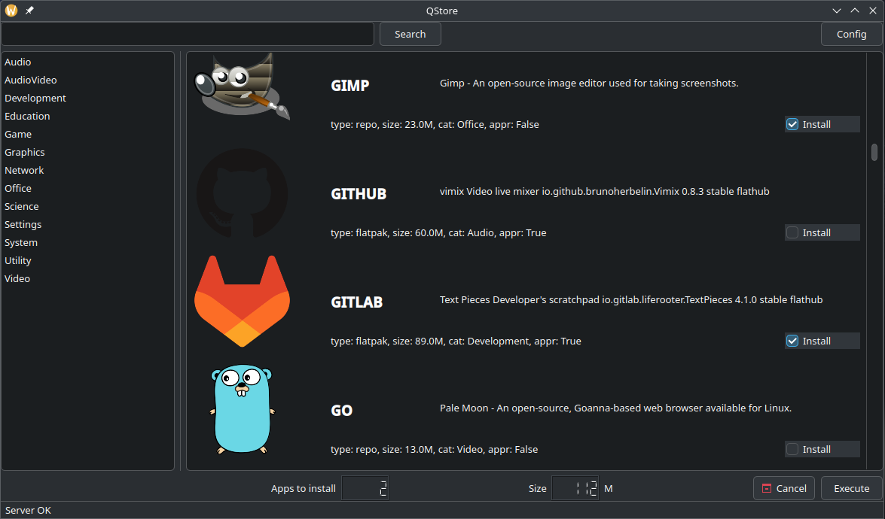

# Qstore

Application store for an import-independent corporate environment (Linux).
Allows installation of certain software with user rights.
Works via a system service (systemd unit). The user is limited by a "white" list of software.

## Features

* Installing software from standard OS repositories. /etc/apt/* or /etc/dnf/*
* Installing self-contained flatpak packages at the user or system level
* Installing individual packages (deb or rpm) from a web server
* Installing software via ansible playbook tasks

## White list

The corporate web server acts as an arbitrator. The web server filters POST requests, removing software not from the white list,
the system service on the user's PC executes tasks only from the web server. The identifier is the computer name,
the user name is saved in the request for installing flatpak packages at the user level.

## Scheme

## Qstore configuration

The program configuration is read from the following files in the specified order:

* ./qstore.conf
* ~/.local/qstore/qstore.conf
* /usr/local/etc/qstore/qstore.conf

If the file `/usr/local/etc/qstore/qstore.conf` is present on the system, qstore assumes that the system is managed by an organization
and does not allow the user to change the program settings.

If the url does not contain the http(s):// protocol, then url = server_url + url.

If the /usr/local/etc/qstore.conf file exists, Qstore is managed by your organization.

## Qstore start

At the next startup, qstore calls the service. The service calculates the difference between the last executed request
`/usr/local/etc/qstore/<username>@<hostname>.json` and the file on the server, if there are differences, it executes the request from the server.

## Screen

## Installation in "manual" mode

root:
* apt install python-is-python3
* apt install pip
* apt install ansible
* apt install python3.11-venv
* ansible-playbook --connection=local -i localhost, qstore-systemd.yml

user:
* python -m venv .venv
* source .venv/bin/activate
* pip install pyqt6
* pip install requests
* python post-server.py &
* python qstore.py
 
